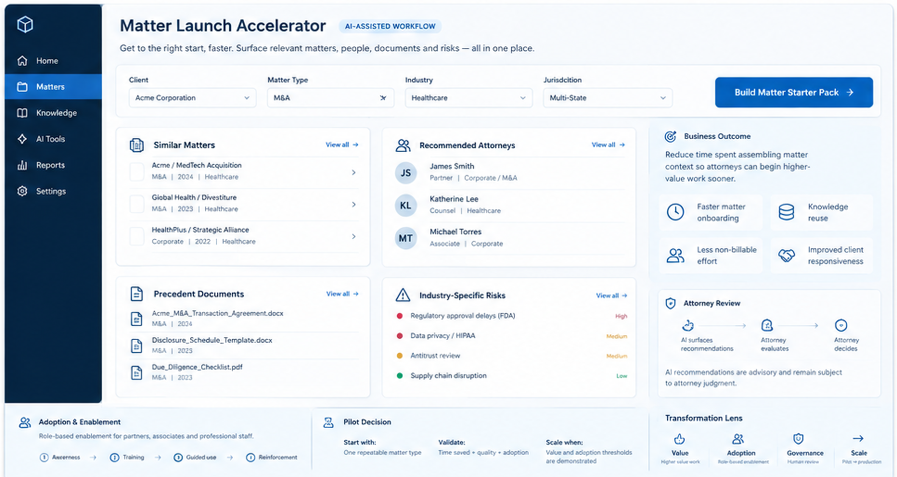
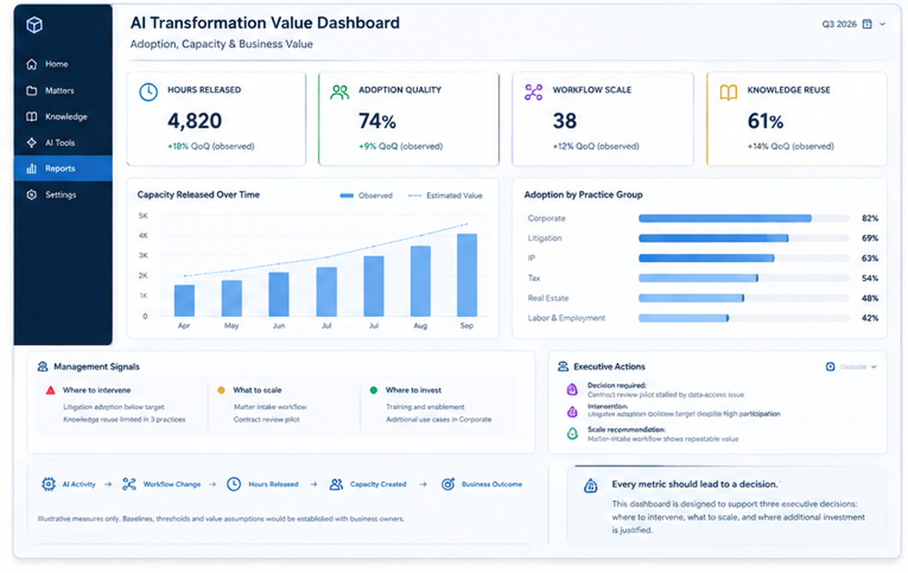
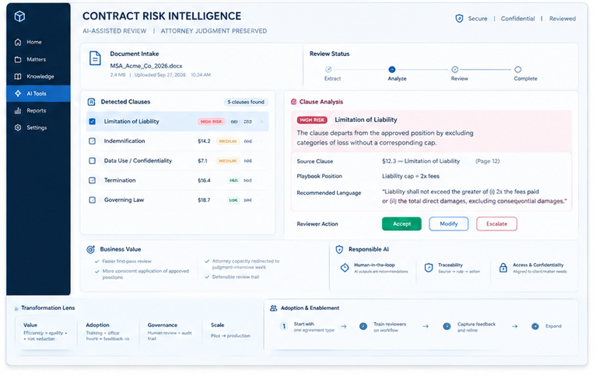

# AI Transformation Portfolio

Operationalizing AI strategy through workflow design, measurable value, responsible adoption and scale.

These illustrative concepts demonstrate how AI can be translated into practical attorney workflows, measurable business value, and responsible adoption within large law firms.

---

## 01 — WORKFLOW

### Matter Launch Accelerator

Accelerating matter startup through knowledge reuse, workflow guidance, and targeted attorney enablement.

**View the Executive Brief →**  
[Open Matter Launch Accelerator](1%20-%20Matter%20Launch%20Accelerator.pdf)

---

## 02 — VALUE

### AI Transformation Value Dashboard

Connecting AI adoption to capacity released, workflow scale, knowledge reuse, and management action.

**View the Executive Brief →**  
[Open AI Transformation Value Dashboard](2%20-%20AI%20Transformation%20Value%20Dashboard.pdf)

---

## 03 — GOVERNANCE

### Contract Risk Intelligence

AI-assisted contract review designed to accelerate triage while preserving attorney judgment, traceability, and responsible-use controls.

**View the Executive Brief →**  
[Open Contract Risk Intelligence](3%20-%20Contract%20Risk%20Intelligence.pdf)

---

## Additional Work

### AI Legal Transformation Dashboard Suite

An additional visual work sample illustrating how AI transformation can be translated into measurable management, adoption, and value-realization practices.

---

## Transformation Lens

The three primary concepts represent complementary dimensions of AI transformation:

**WORKFLOW** — How AI changes the way work gets done.  
**VALUE** — How leadership measures whether the change is working.  
**GOVERNANCE** — How AI is deployed responsibly and scaled with confidence.

Together, they illustrate the bridge from AI strategy to practical adoption.

---

### About These Prototypes

These are illustrative workflow and communication prototypes created to demonstrate transformation thinking, business-value framing, adoption strategy, and responsible AI governance. They are not production software or representations of any firm's existing systems.
